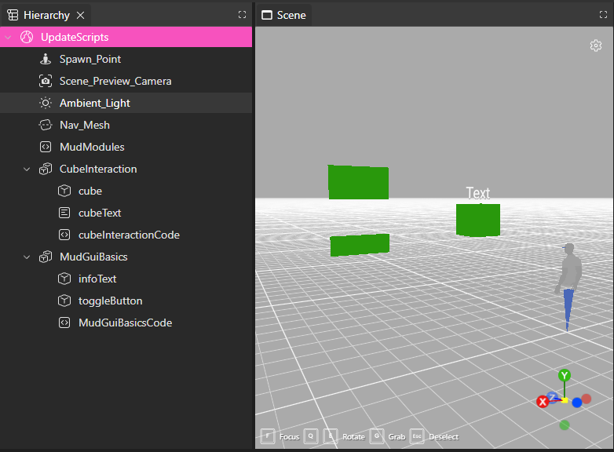

# MudFoundation

Reusable scripts for MUD XR Creator: ray interaction that works the same with a mouse or XR controllers, XR locomotion, and 3D text and buttons.

| Module | What it does |
| --- | --- |
| `RayInteractor` | Hover, exit, and click callbacks for any object in the scene |
| `UnifiedRaycast` | One list of pointers per frame — the mouse on desktop, one per controller in XR |
| `XRRig` | Starts XR input, draws the controller rays, and moves the player with the left thumbstick |
| `MudGui` | `MudText` panels and clickable `MudButton`s |

The modules are loaded once by a `MudModules` Behavior and shared with the rest of your scene. Add it before anything else; [Part 3](#part-3-mudmodules) explains how it works.

### Files

| File | |
| --- | --- |
| [MudModules.js](MudModules.js) | Paste into a Behavior at the top of your scene. Loads the modules and shares them |
| [cubeInteraction.js](cubeInteraction.js) | Example: a clickable cube ([Part 1](#part-1-making-an-object-interactive)) |
| [MudGuiBasics.js](MudGuiBasics.js) | Example: a button that shows and hides a text panel ([Part 2](#part-2-mudgui--text-and-buttons)) |
| `RayInteractor.js`, `UnifiedRaycast.js`, `XRRig.js`, `MudGui.js` | Module source code |
| `dist/` | The versions `MudModules` downloads, generated by `build.py` |

### Setting up your scene



This is the example scene, with both examples set up:

- **`MudModules`** is a Behavior near the top, above every Behavior that uses it.
- **`CubeInteraction`** is a group holding the `cube`, its `cubeText` panel, and `cubeInteractionCode`, a Behavior containing [cubeInteraction.js](cubeInteraction.js).
- **`MudGuiBasics`** is a group holding the `infoText` and `toggleButton` planes, and `MudGuiBasicsCode`, a Behavior containing [MudGuiBasics.js](MudGuiBasics.js).

Keeping each example's objects and code in one group makes it easy to copy into another scene. The object names must match the names used in the code.

---

## Part 1: Making an object interactive

[cubeInteraction.js](cubeInteraction.js) makes a cube clickable: hovering shows a pointer cursor, and clicking shows or hides a text panel. Everything below works with the mouse and with either XR controller, with no extra code.

### Scene setup

1. Add a `MudModules` Behavior at the top of the hierarchy ([Part 3](#part-3-mudmodules)).
2. Add a cube named `cube` and a text object named `cubeText`.
3. Add a Behavior and paste in `cubeInteraction.js`.

### 1. Import what you need

```js
#pragma import (ray, input)
#pragma lifecycle(startup, update, dispose)
```

`ray` gives you the `RayInteractor` class and `input` gives you the pointers. Both come from `MudModules`.

### 2. Find your scene objects

```js
const cube          = cast(scene.getObjectByName("cube"), THREE.Object3D);
const cubeTextPanel = cast(scene.getObjectByName("cubeText"), THREE.Object3D);

cubeTextPanel.visible = false;
```

The names must match the object names in the hierarchy exactly.

### 3. Create an interactor and give it callbacks

```js
const cubeInteractor = new ray.RayInteractor(cube);

cubeInteractor.onEnter = (_hit, pointer) => {
    input.setCursor(pointer, 'pointer');
};
cubeInteractor.onExit = (_hit, pointer) => {
    input.setCursor(pointer, 'default');
};
cubeInteractor.onClick = (_hit) => {
    cubeTextPanel.visible = !cubeTextPanel.visible;
};
```

A `RayInteractor` watches one object, including its children. Assign any of these callbacks; the ones you leave out do nothing.

| Callback | Fires when |
| --- | --- |
| `onEnter(hit, pointer)` | A pointer starts pointing at the object |
| `onHover(hit, pointer)` | Every frame a pointer is on the object |
| `onExit(hit, pointer)` | A pointer moves off the object |
| `onClick(hit, pointer)` | The mouse button or trigger is released while on the object |

- `hit` is the Three.js intersection: `hit.object` is the mesh that was hit, `hit.point` is where.
- `pointer` says which input did it: `pointer.id` is `'mouse'`, `'left'` or `'right'`.
- `input.setCursor` changes the mouse cursor; for XR controllers it does nothing, so it's safe to call either way.

Each pointer is tracked separately, so both controllers can hover the same object at once and each gets its own enter and exit.

### 4. Update it every frame, and reset it on dispose

```js
function update() {
    cubeInteractor.update(input.getPointers());
}

function dispose() {
    cubeInteractor.reset();
}
```

The interactor only checks for hovers and clicks when you call `update`. `reset` fires `onExit` for anything still hovered, so objects aren't left stuck in their hover state.

### Adding more objects

Create one `RayInteractor` per object and update each one with the same pointer list:

```js
function update() {
    const pointers = input.getPointers();
    cubeInteractor.update(pointers);
    sphereInteractor.update(pointers);
}
```

`MudModules` reads the mouse and controllers once at the start of each frame, and `getPointers()` returns that same list to every Behavior that asks. That way a trigger release reaches every button and object, not just the first Behavior to check.

---

## Part 2: MudGui — text and buttons

`MudGui` draws text onto flat panels in 3D space. `MudText` shows text; `MudButton` is a `MudText` that highlights on hover and can be clicked.

[MudGuiBasics.js](MudGuiBasics.js) is a button that shows and hides a text panel. The button's label always says what the next click will do.

### Scene setup

1. Make sure `MudModules` is at the top of the hierarchy ([Part 3](#part-3-mudmodules)).
2. Add two planes named `toggleButton` and `infoText`, where you want the button and the panel.
3. Add a Behavior below `MudModules` and paste in `MudGuiBasics.js`.

### 1. Import what you need

```js
#pragma import (gui, input)
#pragma lifecycle(startup, update, dispose)
```

`gui` gives you `MudText` and `MudButton`. `input` gives you the pointers the button needs.

### 2. Create the panel and the button

```js
const infoText = gui.MudText({
    sceneMesh: scene.getObjectByName("infoText"),
    text:      'Hello! This panel is toggled by the button.',
    fontSize:  40,
});

const toggleButton = gui.MudButton({
    sceneMesh: scene.getObjectByName("toggleButton"),
    text:      'Show info',
});
```

`sceneMesh` tells MudGui to use the plane from the editor: it takes the plane's position, rotation and size, hides the plane, and draws the panel in its place. `MudGuiBasics.js` lists [every option](#options) with its default, so you can see what to change.

### 3. Handle the click

```js
toggleButton.onClick = () => {
    if (infoText.mesh.visible == true) {
        infoText.mesh.visible = false;
        toggleButton.setText('Show info');
    } else {
        infoText.mesh.visible = true;
        toggleButton.setText('Hide info');
    }

    toggleButton.hover();
};
```

Show or hide any panel by setting its `mesh.visible`.

`setText` redraws the button in its normal colors, even though the pointer is still on it. Calling `hover()` afterward keeps the highlight until the pointer moves off.

### 4. Start hidden, update every frame, dispose at the end

```js
function startup() {
    infoText.mesh.visible = false;
}

function update() {
    toggleButton.update(input.getPointers());
}

function dispose() {
    toggleButton.dispose();
    infoText.dispose();
}
```

- The button only checks for hovers and clicks when you call `update`, just like a `RayInteractor`.
- `dispose()` removes the panels from the scene. Without it, every run of the script adds new panels, and old copies pile up in the same spot. A hidden panel can then look like it's still showing, because an old copy sits behind it.

### Placing panels from code

Instead of `sceneMesh`, you can give a size in meters and add the mesh yourself:

```js
const title = gui.MudText({ text: 'Welcome', width: 0.4, height: 0.15 });
title.mesh.position.set(0, 1.5, -1);
scene.add(title.mesh);
```

When you use `sceneMesh`, the panel's width and height come from the plane's size along X and Y. The plane should face forward (along Z) before you rotate it.

### Changing text

```js
infoText.setText('New text');
```

Long text wraps onto several lines and is centered. `setText` redraws the whole panel, so call it only when the text changes, not every frame.

### Options

Every option is optional.

| Option | `MudText` default | `MudButton` default | |
| --- | --- | --- | --- |
| `sceneMesh` | `null` | `null` | Editor object to take the position, rotation and size from |
| `text` | `''` | `''` | |
| `width`, `height` | `0.4`, `0.15` | `0.4`, `0.15` | Size in meters; ignored when `sceneMesh` is set |
| `resolution` | `512` | `512` | Canvas width in pixels; raise it if text looks blurry |
| `fontSize` | `48` | `48` | In canvas pixels |
| `fontFamily` | `'Arial'` | `'Arial'` | |
| `textColor` | `'#ffffff'` | `'#ffffff'` | |
| `backgroundColor` | `'#222222'` | `'#2255cc'` | |
| `borderColor` | `'#555555'` | `'#99bbff'` | |
| `borderWidth` | `6` | `6` | In canvas pixels; `0` for no border |
| `borderRadius` | `24` | `24` | Corner rounding, in canvas pixels |
| `hoverBackgroundColor` | — | `'#4477ff'` | Background while a pointer is on the button |
| `hoverBorderColor` | — | `'#ffffff'` | Border while a pointer is on the button |

### What you get back

| | `MudText` | `MudButton` | |
| --- | --- | --- | --- |
| `mesh` | ✓ | ✓ | The panel mesh; set `mesh.visible` to show or hide it |
| `setText(text)` | ✓ | ✓ | Change the text |
| `dispose()` | ✓ | ✓ | Remove it from the scene; call it in your Behavior's `dispose` |
| `onClick(hit, pointer)` | | ✓ | Assign this to handle clicks |
| `update(pointers)` | | ✓ | Call every frame with `input.getPointers()` |
| `reset()` | | ✓ | Clear the hover state, e.g. when hiding the button |
| `hover()`, `unhover()` | | ✓ | Force the hover look on or off |

To hide a button, set `button.mesh.visible = false` and call `button.reset()`. Rays still hit hidden objects, so also skip `button.update(...)` while it's hidden.

---

## Part 3: MudModules

[MudModules.js](MudModules.js) loads the modules from this repository and shares them with the rest of your scene. Add it once, as its own Behavior.

```js
#pragma import(RayInteractor  = "https://cdn.jsdelivr.net/gh/zevenrodriguez/MudFoundation@d5c718f/dist/RayInteractor.js")
#pragma import(XRRig          = "https://cdn.jsdelivr.net/gh/zevenrodriguez/MudFoundation@d5c718f/dist/XRRig.js")
#pragma import(UnifiedRaycast = "https://cdn.jsdelivr.net/gh/zevenrodriguez/MudFoundation@d5c718f/dist/UnifiedRaycast.js")
#pragma import(MudGui         = "https://cdn.jsdelivr.net/gh/zevenrodriguez/MudFoundation@d5c718f/dist/MudGui.js")

const ray   = RayInteractor({});
const rig   = XRRig({ THREE, scene, camera, Input, avatarRig, avatarPOV });
const input = UnifiedRaycast({ THREE, renderer, camera, Input, MouseButton });
const gui   = MudGui({ THREE, scene, renderer, RayInteractor: ray.RayInteractor });

function startup() {
    rig.startup();
    input.startup();
}

function update(delta) {
    rig.update(delta);
    input.update();
}

function dispose() {
    input.dispose();
    rig.dispose();
    renderer.domElement.style.cursor = 'default';
}

#pragma export (ray, rig, input, gui)
```

It does three things:

1. **Loads the modules from the web.** The URL form of `#pragma import` ([MUD docs: dynamic imports](https://docs.mud.foundation/Advance%20Documentation/dynamic-import)) downloads each file when the scene starts, so you don't paste the modules into every project.
2. **Sets each module up.** A loaded module can't see MUD's built-in objects on its own, so each one is a function you call with the objects it needs (`THREE`, `scene`, `Input`, ...). The result is what gets exported.
3. **Runs their startup, update and dispose.** MUD doesn't call lifecycle hooks for loaded modules, so `MudModules` calls them from its own:
   - `startup` starts XR and mouse input.
   - `update` moves the player (`rig.update`) and reads the mouse and controllers for this frame (`input.update`).
   - `dispose` stops input when the scene closes.

   Because this happens only here, it runs once per frame no matter how many Behaviors import the modules.

`input.update()` matters for XR. Reading a controller's trigger release uses it up, so if every Behavior read the controllers itself, only the first one each frame would get the click. Instead, `MudModules` reads them once, and `input.getPointers()` hands every Behavior that same list.

Any Behavior can then use them with a normal import:

```js
#pragma import (ray, input, gui)
```

| Export | Use it for |
| --- | --- |
| `ray` | `new ray.RayInteractor(object)` |
| `input` | `input.getPointers()`, `input.setCursor(pointer, style)`, `input.PointerType` |
| `gui` | `gui.MudText({...})`, `gui.MudButton({...})` |
| `rig` | Controller ray lines and locomotion; usually you don't need to touch it |

### It must run first

MUD needs an export to exist before anything imports it. Put `MudModules` above every other Behavior in the hierarchy, or give it the lowest `executionIndex`. If another Behavior reports that `ray`, `input` or `gui` is undefined, this is the cause.

Running first also means `input.update()` has read this frame's pointers before your Behaviors call `getPointers()`.

### Updating the modules

The URLs are pinned to a commit (`@d5c718f`). The headset's browser keeps downloaded files for up to 7 days, so a link like `@main` can keep running old code after you push a fix. A new commit hash is a new link, so it always loads fresh.

The files in `dist/` are generated from the source files in the repository root. To change a module:

1. Edit the source file, e.g. `UnifiedRaycast.js`.
2. Run `python build.py` to regenerate `dist/`.
3. Commit and push both.
4. Change the `@<hash>` in `MudModules.js` to the new commit hash (`git log -1 --format=%h`).

---

## Troubleshooting

| Problem | Cause and fix |
| --- | --- |
| `ray`, `input` or `gui` is undefined | `MudModules` isn't running first. Move it to the top of the hierarchy or give it the lowest `executionIndex` |
| A fix you pushed doesn't show up in the headset | The browser is still using its saved copy of the old files. Point `MudModules.js` at the new commit hash ([Updating the modules](#updating-the-modules)) |
| Clicking hides a panel but it still looks visible | Old copies of the panel from earlier runs are behind it. Call `dispose()` on every `MudText` and `MudButton` in your Behavior's `dispose`, then reload the scene |
| The button loses its highlight after a click | `setText` redraws in the normal colors. Call `button.hover()` right after it |
| XR clicks only work on some objects | Every Behavior must get pointers from `input.getPointers()`, not read `Input.xr` directly, and `MudModules` must call `input.update()` |
